# 🎨 API Cost Optimization Platform - System Diagrams

This document contains all the visual diagrams for the API Cost Optimization Platform. These diagrams are created using Mermaid syntax and can be rendered as images in various formats including JPG, PNG, and SVG.

## 📋 Table of Contents
- [Complete System Architecture](#complete-system-architecture)
- [Detailed Process Flow](#detailed-process-flow)
- [Technical Architecture](#technical-architecture)
- [How to Convert to JPG](#how-to-convert-to-jpg)

---

## 🏗️ Complete System Architecture

This diagram shows the overall system architecture including user layers, frontend components, backend services, business logic, and external API integrations.

```mermaid
graph TB
    %% User Layer
    subgraph "👤 User Layer"
        U1[Admin User]
        U2[Developer User]
    end

    %% Frontend Layer
    subgraph "🖥️ Frontend Layer (React + Vite)"
        subgraph "Authentication Flow"
            A1[Login Page]
            A2[Signup Page]
            A3[Auth Context]
        end
        
        subgraph "Protected Pages"
            P1[Dashboard]
            P2[API Logs]
            P3[Pricing Rules]
            P4[Alerts]
            P5[Budgets]
            P6[Optimization]
            P7[Profile]
            P8[Test Logger]
        end
        
        subgraph "Components"
            C1[Layout]
            C2[Protected Route]
        end
        
        subgraph "Services"
            S1[API Service]
            S2[API Log Service]
        end
    end

    %% Backend API Layer
    subgraph "⚙️ Backend Layer (Node.js + Express)"
        subgraph "Routes & Controllers"
            R1[Auth Routes]
            R2[Analytics Routes]
            R3[API Log Routes]
            R4[Pricing Routes]
            R5[Alert Routes]
            R6[Budget Routes]
            R7[Optimization Routes]
        end
        
        subgraph "Core Middleware"
            M1[API Tracker Middleware]
            M2[Auth Middleware]
            M3[CORS Middleware]
        end
        
        subgraph "Controllers"
            CT1[Auth Controller]
            CT2[Analytics Controller]
            CT3[API Log Controller]
            CT4[Pricing Controller]
            CT5[Alert Controller]
            CT6[Budget Controller]
            CT7[Optimization Controller]
        end
    end

    %% Business Logic Layer
    subgraph "🧠 Business Logic Layer"
        subgraph "Core Engines"
            E1[Cost Calculator]
            E2[Optimization Engine]
            E3[Anomaly Detector]
        end
        
        subgraph "Data Models"
            D1[User Model]
            D2[API Log Model]
            D3[Budget Model]
            D4[Alert Model]
            D5[Pricing Rule Model]
        end
    end

    %% External Services
    subgraph "🌐 External API Services"
        EXT1[Twilio API]
        EXT2[OpenAI API]
        EXT3[Google Maps API]
        EXT4[Stripe API]
        EXT5[Other APIs]
    end

    %% Database Layer
    subgraph "🗄️ Database Layer"
        DB[(MongoDB)]
    end

    %% Main Flow Connections
    U1 --> A1
    U2 --> A1
    A1 --> A3
    A2 --> A3
    A3 --> C2
    C2 --> C1
    C1 --> P1
    C1 --> P2
    C1 --> P3
    C1 --> P4
    C1 --> P5
    C1 --> P6
    C1 --> P7
    C1 --> P8

    %% Frontend to Backend API calls
    S1 --> R1
    S1 --> R2
    S1 --> R4
    S1 --> R5
    S1 --> R6
    S1 --> R7
    S2 --> R3

    %% Routes to Controllers
    R1 --> CT1
    R2 --> CT2
    R3 --> CT3
    R4 --> CT4
    R5 --> CT5
    R6 --> CT6
    R7 --> CT7

    %% Middleware Flow
    M3 --> M2
    M2 --> M1
    M1 --> R1
    M1 --> R2
    M1 --> R3
    M1 --> R4
    M1 --> R5
    M1 --> R6
    M1 --> R7

    %% Controllers to Business Logic
    CT1 --> D1
    CT2 --> E3
    CT3 --> D2
    CT4 --> D5
    CT5 --> D4
    CT6 --> D3
    CT7 --> E2

    %% Business Logic Interactions
    E1 --> D5
    E1 --> D2
    E2 --> D2
    E2 --> D5
    E3 --> D2
    E3 --> D4

    %% API Tracking Flow (Core Feature)
    M1 -.->|Intercepts| EXT1
    M1 -.->|Intercepts| EXT2
    M1 -.->|Intercepts| EXT3
    M1 -.->|Intercepts| EXT4
    M1 -.->|Intercepts| EXT5
    
    EXT1 -.->|Response| M1
    EXT2 -.->|Response| M1
    EXT3 -.->|Response| M1
    EXT4 -.->|Response| M1
    EXT5 -.->|Response| M1
    
    M1 --> E1
    E1 --> D2

    %% Database Connections
    D1 --> DB
    D2 --> DB
    D3 --> DB
    D4 --> DB
    D5 --> DB

    %% Admin-Only Features
    U1 -.->|Admin Only| P3
    U1 -.->|Admin Only| P5
    U1 -.->|Admin Only| P4

    %% Real-time Features
    P2 -.->|Real-time| D2
    P1 -.->|Analytics| E3
    P6 -.->|Suggestions| E2

    %% Styling
    classDef userClass fill:#e1f5fe,stroke:#01579b,stroke-width:2px
    classDef frontendClass fill:#f3e5f5,stroke:#4a148c,stroke-width:2px
    classDef backendClass fill:#e8f5e8,stroke:#1b5e20,stroke-width:2px
    classDef logicClass fill:#fff3e0,stroke:#e65100,stroke-width:2px
    classDef externalClass fill:#ffebee,stroke:#b71c1c,stroke-width:2px
    classDef databaseClass fill:#e0f2f1,stroke:#004d40,stroke-width:2px

    class U1,U2 userClass
    class A1,A2,A3,P1,P2,P3,P4,P5,P6,P7,P8,C1,C2,S1,S2 frontendClass
    class R1,R2,R3,R4,R5,R6,R7,M1,M2,M3,CT1,CT2,CT3,CT4,CT5,CT6,CT7 backendClass
    class E1,E2,E3,D1,D2,D3,D4,D5 logicClass
    class EXT1,EXT2,EXT3,EXT4,EXT5 externalClass
    class DB databaseClass
```



---

## 🔄 Detailed Process Flow

This diagram illustrates the step-by-step process of API tracking, cost calculation, and optimization workflow.

```mermaid
flowchart TD
    %% Start
    A[📱 Application Makes API Call] --> B{🔍 API Tracker Middleware}
    
    %% API Tracking Process
    B --> C[📝 Log API Call Details]
    C --> D[⏱️ Record Start Time]
    D --> E[🌐 Execute External API Call]
    
    %% API Response Handling
    E --> F{✅ API Call Success?}
    F -->|Yes| G[📊 Calculate Response Time]
    F -->|No| H[❌ Log Error Details]
    
    %% Cost Calculation
    G --> I[💰 Cost Calculator]
    H --> I
    I --> J[📋 Get Pricing Rules]
    J --> K[🧮 Calculate Estimated Cost]
    
    %% Data Storage
    K --> L[💾 Save API Log to MongoDB]
    L --> M[🔄 Update Real-time Dashboard]
    
    %% Analytics & Processing
    M --> N[📈 Analytics Processing]
    N --> O{🚨 Anomaly Detection}
    O -->|Anomaly Detected| P[🔔 Trigger Alert]
    O -->|Normal Usage| Q[📊 Update Analytics]
    
    %% Budget & Optimization
    P --> R[💳 Budget Controller]
    Q --> R
    R --> S{💸 Budget Exceeded?}
    S -->|Yes| T[🚨 Budget Alert]
    S -->|No| U[✅ Continue Monitoring]
    
    %% Optimization Engine
    T --> V[⚙️ Optimization Engine]
    U --> V
    V --> W[💡 Generate Suggestions]
    W --> X[📋 Display Recommendations]
    
    %% User Interaction Points
    Y[👤 User Views Dashboard] --> Z[📊 Real-time Analytics]
    Z --> AA[📝 API Logs View]
    AA --> BB[💰 Cost Breakdown]
    BB --> CC[🎯 Optimization Tips]
    
    %% Admin Functions
    DD[👨‍💼 Admin User] --> EE[⚙️ Manage Pricing Rules]
    DD --> FF[💰 Set Budgets]
    DD --> GG[🔔 Configure Alerts]
    
    %% Data Flow Connections
    L -.-> Z
    W -.-> CC
    EE --> J
    FF --> R
    GG --> P
    
    %% Styling with colors
    classDef processClass fill:#e3f2fd,stroke:#1976d2,stroke-width:2px
    classDef decisionClass fill:#fff3e0,stroke:#f57c00,stroke-width:2px
    classDef dataClass fill:#e8f5e8,stroke:#388e3c,stroke-width:2px
    classDef alertClass fill:#ffebee,stroke:#d32f2f,stroke-width:2px
    classDef userClass fill:#f3e5f5,stroke:#7b1fa2,stroke-width:2px
    classDef externalClass fill:#fce4ec,stroke:#c2185b,stroke-width:2px
    
    class A,C,D,E,G,I,J,K,L,M,N,V,W processClass
    class B,F,O,S decisionClass
    class L,AA,BB,Z dataClass
    class H,P,T alertClass
    class Y,DD,X,CC,EE,FF,GG userClass
    class E externalClass
```



---

## ⚙️ Technical Architecture

This diagram shows the detailed technical stack and infrastructure components.


---

## 🔄 How to Convert to JPG

To convert these Mermaid diagrams to JPG format, you can use any of the following methods:

### Method 1: Mermaid Live Editor
1. Visit [mermaid.live](https://mermaid.live)
2. Copy each diagram code block
3. Paste it into the editor
4. Click "Actions" → "Export as JPG"

### Method 2: VS Code Extension
1. Install the "Mermaid Preview" extension in VS Code
2. Open this file and preview the diagrams
3. Right-click on rendered diagram → "Save Image As"

### Method 3: Command Line Tool
```bash
npm install -g @mermaid-js/mermaid-cli
mmdc -i diagram.mmd -o diagram.jpg -t dark -b white
```

### Method 4: Online Converters
- **Kroki.io**: Paste Mermaid code and download as JPG
- **Mermaid.ink**: Generate shareable diagram URLs
- **GitHub**: Renders Mermaid automatically in markdown files

---

## 📝 Notes

- All diagrams use **Mermaid syntax** (text-based diagramming)
- **Color-coded** for different system layers
- **Responsive design** - works on different screen sizes
- **Interactive elements** when viewed in supported platforms
- **Professional styling** with emojis for visual clarity

---

*Created for API Cost Optimization Platform - February 8, 2026*